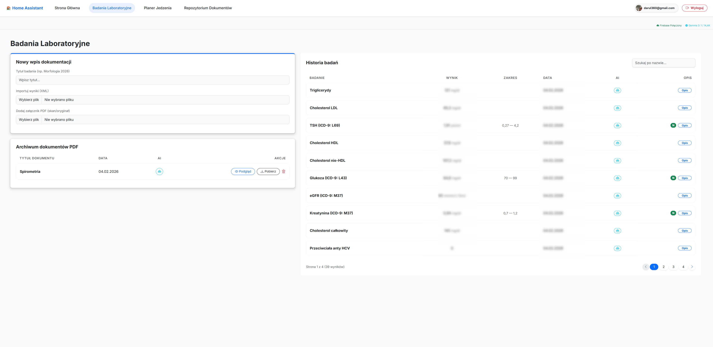
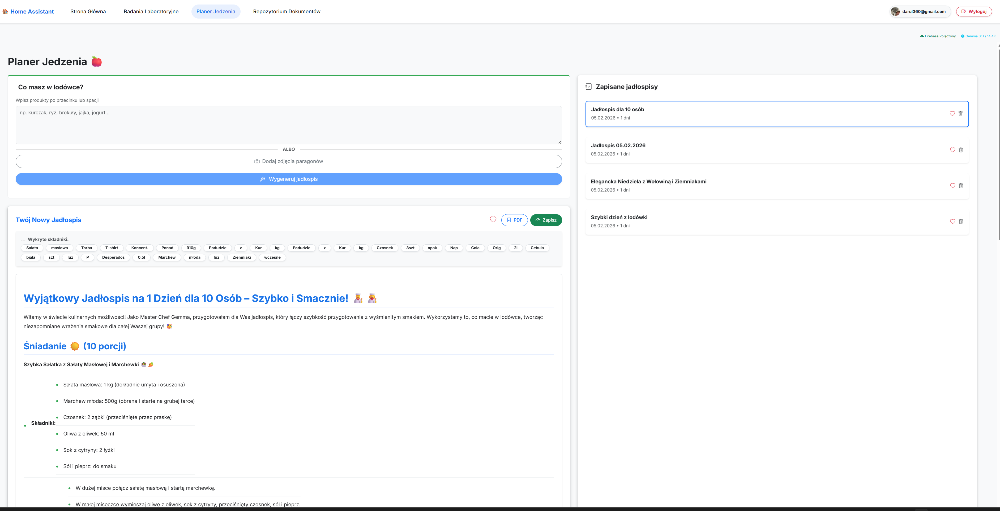
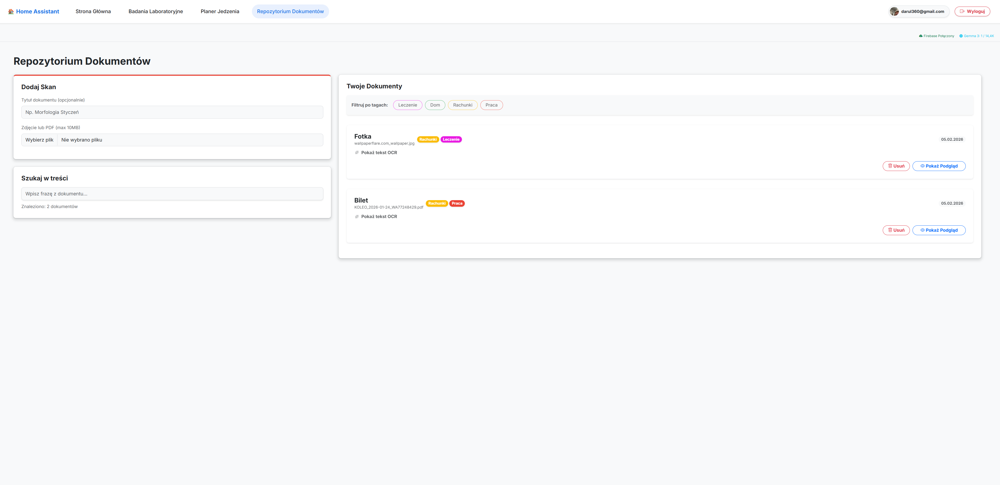

# HomeApp - Smart Home & Personal Assistant

HomeApp is a powerful, modern web application built with Blazor WebAssembly that serves as your central command center for home management, health tracking, and meal planning, powered by Gemini AI and Firebase.





## Key Features
- **📊 Medical Dashboard**: Import and visualize laboratory test results (XML), track health trends, and store PDF results.
- **📄 Document Repository**: Intelligent document storage with automated OCR and intelligent tagging.
- **🍎 AI Food Planner**: Generate custom meal plans based on what's in your fridge using Gemini AI.
- **🛡️ Secure Access**: Built-in Google Authentication and dynamic Firestore-based whitelisting.
- **🤖 AI Analysis**: Instant analysis of medical results and documents using state-of-the-art AI.

## Project Structure
- `HomeApp.Client`: Blazor WebAssembly frontend application.
- `HomeApp.Shared`: Shared data models and logic.

## Technical Stack
- **Frontend**: Blazor WebAssembly (.NET 10.0)
- **Styling**: Bootstrap 5 + Vanilla CSS (Modern aesthetic)
- **Backend & Database**: Firebase (Auth, Firestore, Storage)
- **AI Engine**: Google Gemini API
- **Utilities**: pdf-lib, LiveCharts2, Tesseract.js

## ⚙️ Setup & Deployment

### 1. Firebase Configuration
1.  Create a new project in the [Firebase Console](https://console.firebase.google.com/).
2.  Enable **Google Authentication**.
3.  Set up **Firestore Database** in test or production mode.
4.  Enable **Firebase Storage**.
5.  Register a new Web App in your Firebase project and get the configuration object.
6.  Navigate to `wwwroot/` and create `firebase_config.json` (see template below).

### 2. Google Gemini API
1.  Obtain an API key from the [Google AI Studio](https://aistudio.google.com/).
2.  Add the key to your `firebase_config.json`.

### 3. `firebase_config.json` Template
Create this file in `HomeApp.Client/wwwroot/firebase_config.json`:
```json
{
  "apiKey": "YOUR_FIREBASE_API_KEY",
  "authDomain": "YOUR_PROJECT_ID.firebaseapp.com",
  "projectId": "YOUR_PROJECT_ID",
  "storageBucket": "YOUR_PROJECT_ID.appspot.com",
  "messagingSenderId": "YOUR_SENDER_ID",
  "appId": "YOUR_APP_ID",
  "geminiApiKey": "YOUR_GEMINI_API_KEY"
}
```

### 4. Dynamic Whitelisting Setup
To control access, create a collection in Firestore named `whitelist`. Each document represents an authorized user:
- **Collection**: `whitelist`
- **Field**: `email` (string)
- **Value**: `user@example.com`

## 🚀 How to Run Locally
1.  Clone the repository.
2.  Ensure you have established your `firebase_config.json` as described above.
3.  Open the solution in Visual Studio or use the command line:
    ```bash
    cd HomeApp.Client
    dotnet run
    ```

## 📝 Acknowledgments
Developed with support from **Antigravity** – an advanced agentic AI coding assistant designed by Google DeepMind.
